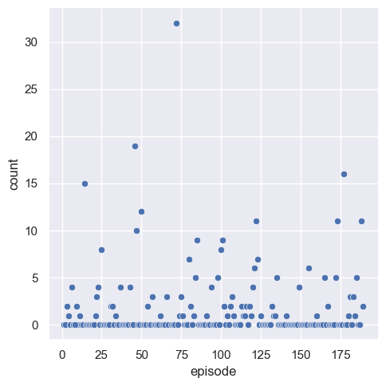

# Project Topta 

TOPTA stands for The Ongeloofelijke Podcast Text Analyser. 

In Episode 181 of the [Ongelooflijke Podcast](https://www.eo.nl/podcasts/de-ongelooflijke-podcast), David Boogerd wonders : 

> In how many episodes do we mention Augustinus? Co-host Stefan Paas thinks it is 80%.

This codebase analyses all the podcast (up to episode 189) for occurrences of Augustinus by downloading all episodes, performing a speech-to-text conversion and finally the counting. 

## Result
The count of the word Augustinus per episode. 

In 73 out of 189 analysed episodes Augustinus is mentioned. 
A 38% chance. 

## Get audio files 
Find online a 'source' data file which contains the complete selection of podcast links. I have used [this](https://podcastluisteren.nl/pod/De-Ongelooflijke-Podcast) one, see browsers Developer Tools, Network tab and look for a json file that looks like all podcasts. See the `data.json` file. 

Download all of the eposides as mp3. The total size of audio is around 16 Gb.

## Transcribing
The downloaded files needs to be converted to text and we have used OpenAI Whisper.
Locally is doable, but it will be slow... We utilized the Azure Speech API to do a batch transcription instead.

- create storage account 
- upload all audio files
- use the Azure Speech CLI tool to extract the text files 
- the results are available in the `data` folder as *.mp3.json files 

## Processing 
Additional finetuning / filtering is required because speech-to-text conversion is not perfect..
Augustinus is written in different formats., but we also don't need the month 'Augustus' 

>augustine's augustin's augustinus augustijnse augustini augustine augustus augustinus augustin augmenterend augustines

We removed 'augmenterend' en 'augustus'.

## Guest list 
The guest list per episode (see `guests.txt`) is done by using ChatGPT 
We gave ChatGPT 
- some context, such as : we are looking for the additional speakers besides Stefan Paas and David Boogerd.
- two examples from the `descriptions.txt` file 
- and we gave the answer for the two examples in the format `ANSWER #1: Arjen Lubach` , etc. 
- then we provided batches of the descriptions of 25 episodes and asked ChatGPT to provide us with the answer.

 
## Changelog
23 april : Initial version published.
24 april : Somehow skipped episode 68 in the mp3 download.. Fixed!
           The Guest list is included

### Detailed setup description 

See `requirements.txt` for the pip packages. Use a venv! 

For extracting the lemma's (which we did not use)
- `pip install spacy`
- `python -m spacy download nl_core_news_sm`

For local processing the audio files (with cuda) I also needed: 
- `choco install ffmpeg`
- `pip3 install torch torchvision torchaudio --index-url https://download.pytorch.org/whl/cu121`

